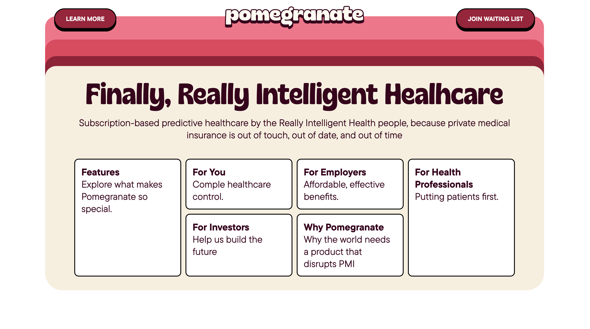

# 🖌️CSS - Pomegranate

Let's practice `responsive design`

## 🏁 STEPS

1. Follow AND read the following HTML guide:
   [HTML GUIDE](https://www.w3schools.com/htmL/html5_syntax.asp)

2. Your task is to create a website that **_closely_** resembles (looks as close
   as possible) to the one found under `/design` folder.



3. In `index.html` file, you will see some pre-made code. For this challenge, you `CANNOT` add/remove anything to the element `header` or any of its children elements. This means, you can't add any attributes, change class names, etc.

4. Your folder structure should look like

```text
.
├── design
│   ├── active-states
│   │   └── hovers.mp4
│   ├── desktop.png
│   ├── mobile-380px.png
│   └── responsive
│       └── responvice-look.mp4
├── index.html
├── .prettierrc
├── package.json
├── node_modules
├── pnpm-lock.yaml
├── src
│   ├── assets
│   │   ├── fonts
│   │   │   ├── gilker-semibold-consensed.woff2
│   │   │   ├── gilker-semiregular-condensed.woff2
│   │   │   └── ttc-pro.woff2
│   │   └── images
│   │       ├── card-pattern.svg
│   │       └── logo.svg
│   └── main.css
└── stylelint.config.js
```

5. You will see the logo section is already presented to you with two `svg` tags, each surrounded by `div` elements. Do not modify the `svg` in any shape or form.

6. In this project you can **_ONLY AND MUST_** use:

```HTML
<header>
<h1>
<div> <!-- <div> NOT SOUPS -->
<nav>
<ul>
<li>
<a>
<main>
<section> <!-- only once! -->
<h2>
<p>
```

---

## 😃 Start coding

- Remember to follow excellent quality control procedures (i.e., no space in
  folders or names, HTML indentation/spacing, closing tags, etc.), `stylelint` and `prettier`
  for formatting.
